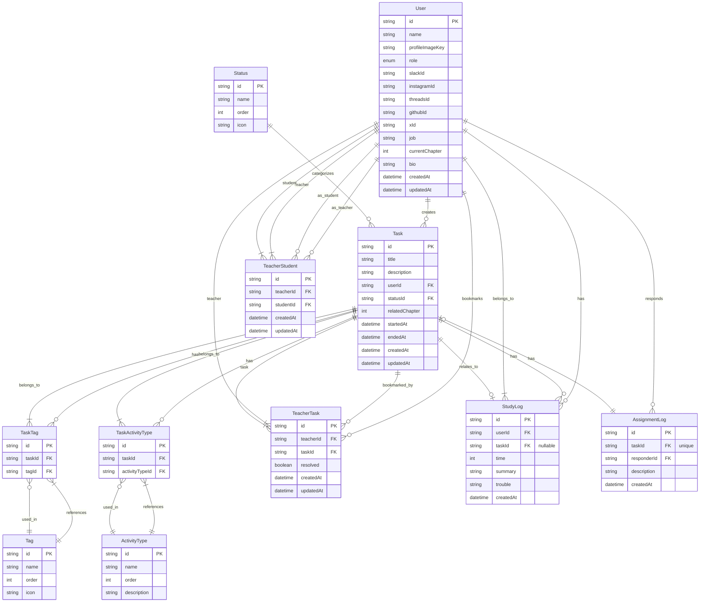

# ER図

```mermaid
erDiagram
    User {
        string id PK
        string name
        string profileImageKey
        enum role
        string slackId
        string instagramId
        string threadsId
        string githubId
        string xId
        string job
        int currentChapter
        string bio
        datetime createdAt
        datetime updatedAt
    }

    Task {
        string id PK
        string title
        string description
        string userId FK
        string statusId FK
        int relatedChapter
        datetime startedAt
        datetime endedAt
        datetime createdAt
        datetime updatedAt
    }

    Status {
        string id PK
        string name
        int order
        string icon
    }

    Tag {
        string id PK
        string name
        int order
        string icon
    }

    ActivityType {
        string id PK
        string name
        int order
        string description
    }

    TaskTag {
        string id PK
        string taskId FK
        string tagId FK
    }

    TaskActivityType {
        string id PK
        string taskId FK
        string activityTypeId FK
    }

    TeacherStudent {
        string id PK
        string teacherId FK
        string studentId FK
        datetime createdAt
        datetime updatedAt
    }

    TeacherTask {
        string id PK
        string teacherId FK
        string taskId FK
        boolean resolved
        datetime createdAt
        datetime updatedAt
    }

    StudyLog {
        string id PK
        string userId FK
        string taskId FK "nullable"
        int time
        string summary
        string trouble
        datetime createdAt
    }

    AssignmentLog {
        string id PK
        string taskId FK "unique"
        string responderId FK
        string description
        datetime createdAt
    }

    %% リレーションシップ
    User ||--o{ Task : "creates"
    User ||--o{ StudyLog : "has"
    User ||--o{ TeacherTask : "bookmarks"
    User ||--o{ TeacherStudent : "as_teacher"
    User ||--o{ TeacherStudent : "as_student"
    User ||--o{ AssignmentLog : "responds"

    Task ||--o{ StudyLog : "has"
    Task ||--o{ TeacherTask : "bookmarked_by"
    Task ||--o{ TaskTag : "has"
    Task ||--o{ TaskActivityType : "has"
    Task |o--|| AssignmentLog : "has"

    Status ||--o{ Task : "categorizes"

    Tag ||--o{ TaskTag : "used_in"

    ActivityType ||--o{ TaskActivityType : "used_in"

    TaskTag }|--|| Task : "belongs_to"
    TaskTag }|--|| Tag : "references"

    TaskActivityType }|--|| Task : "belongs_to"
    TaskActivityType }|--|| ActivityType : "references"

    TeacherStudent }|--|| User : "teacher"
    TeacherStudent }|--|| User : "student"

    TeacherTask }|--|| User : "teacher"
    TeacherTask }|--|| Task : "task"

    StudyLog }|--|| User : "belongs_to"
    StudyLog |o--|| Task : "relates_to"

```
